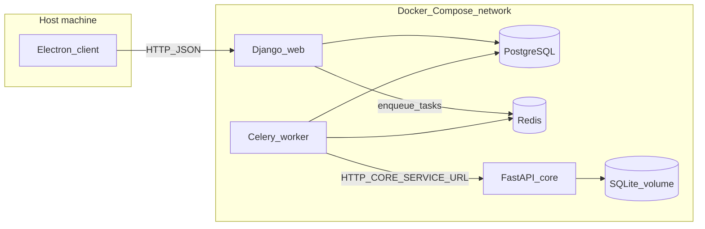

# TheGreatFilter

Desktop and web tooling for water-quality measurements, studies, and AI-driven nano-filter design. The system uses **quantum chemistry simulation** (Hartree-Fock and Variational Quantum Eigensolver) combined with **genetic algorithm optimization** to generate filter designs that maximize pollutant-binding energy for measured water conditions.

The backend is a Django REST API backed by PostgreSQL; long-running filter simulations run in a separate FastAPI **core** service. The desktop app is an Electron + React client that talks only to the API, not to core directly.

More product and API contract detail lives under [docs/](docs/README.md) (PRD, user stories, contracts).

## Tech stack

| Component | Technologies |
|-----------|-------------|
| **Core (simulation)** | FastAPI, PySCF (Hartree-Fock), PennyLane + Qiskit (VQE), DEAP (genetic algorithms), SQLite |
| **Backend** | Django, Django REST Framework, Celery, Redis, PostgreSQL, JWT + Google OAuth |
| **Desktop client** | Electron, React 19, TypeScript, Vite, Tailwind CSS, Leaflet (maps), Recharts, 3Dmol.js (molecular viewer), serialport (USB devices) |
| **Landing page** | Vite + React, Tailwind CSS |
| **Infrastructure** | Docker Compose, PostgreSQL 16, Redis 7 |

## Repository layout

| Path | Role |
|------|------|
| [core/](core/) | FastAPI simulation engine (H2O-Sim): `/health`, `/filters/*`. Runs quantum chemistry (PySCF + PennyLane VQE) and genetic algorithm optimization (DEAP). Uses SQLite on a Docker volume (`DB_PATH=/data/h2osim.db`) and a process pool for heavy work. |
| [server/backend/](server/backend/) | Django REST API, Celery tasks, and app code. In Compose, `./server/backend` is mounted at `/home/app/backend` in the `web` and `worker` containers. |
| [server/](server/) | Docker image build, `requirements.txt`, and `env.example` for backend configuration. |
| [client/](client/) | Electron + Vite + React. API calls use `VITE_API_BASE_URL`; request paths include `/api/...` (see [client/src/renderer/src/utils/api/config.ts](client/src/renderer/src/utils/api/config.ts)). |
| [landingpage/](landingpage/) | Optional Vite + React marketing site; not wired into `docker-compose.yml`. Run locally with `npm install` and `npm run dev`. |
| [docs/](docs/) | Product and flow documentation. |

## Architecture and how services communicate



- **Electron client -> Django `web`:** JWT-authenticated JSON over HTTP (e.g. `http://localhost:8000` from the host). The desktop app **does not** call the core service; only the backend worker does.
- **Django `web` -> PostgreSQL and Redis:** Reads and writes application data; enqueues Celery jobs (for example filter generation).
- **Celery `worker` -> PostgreSQL, Redis, and core:** Executes tasks and calls the simulation service at `CORE_SERVICE_URL` (default `http://core:8000` on the internal network). See [server/backend/filters/services/runner.py](server/backend/filters/services/runner.py) (`POST /filters/generate` and status polling).
- **Core:** Persists simulation-related data in SQLite on the `core-data` volume. For debugging, core is exposed on the host at port **8001**.

## How filter generation works

When a user requests a filter for a water measurement, the system:

1. **Pollutant mapping** — maps measured water parameters (Pb, Cd, Cl, NO3, etc.; 100+ supported) to atomic species for quantum simulation.
2. **Genetic algorithm optimization** (DEAP) — evolves filter designs across 5 parameters:
   - Pore size (0.3-2.0 nm)
   - Layer thickness (0.5-5.0 nm)
   - Material type (graphene, carbon nanotubes, graphene oxide, composite, MOF-like)
   - Functionalization density
   - Doping level (pyridinic nitrogen replacement)
3. **Quantum chemistry evaluation** — for each candidate filter, computes pollutant-material binding energy:
   - **Hartree-Fock** baseline via PySCF (STO-3G basis set)
   - **VQE** refinement via PennyLane with UCCSD-style ansatz (when enabled)
   - Optional execution on **IBM Quantum hardware** via Qiskit
4. **Result** — the best filter design with per-layer binding energies, material composition, and atomic structure (exportable as CSV, XYZ, or SDF).

The client displays results with interactive charts (Recharts), 3D molecular structure visualization (3Dmol.js), and per-pollutant performance metrics.

## Prerequisites

- **Full stack:** [Docker](https://docs.docker.com/get-docker/) and Docker Compose v2.
- **Desktop client:** Node.js (LTS) and npm, for [client/](client/).
- **Landing page (optional):** Node.js and npm in [landingpage/](landingpage/).

Python dependencies are installed inside the Docker images from [server/requirements.txt](server/requirements.txt) and [core/requirements.txt](core/requirements.txt). For local Python work outside Docker, use those files with a virtual environment.

## Quick start: backend and core (Docker)

From the repository root:

1. Copy the environment template and fill in secrets:

   ```bash
   cp server/env.example server/.env
   ```

   Set at minimum a strong `SECRET_KEY`, `DB_PASSWORD` / `POSTGRES_PASSWORD` (same value), and Google OAuth values if you use Google login. See [Environment variables](#environment-variables) below.

2. Start all services:

   ```bash
   docker compose up --build
   ```

3. **Ports (default [docker-compose.yml](docker-compose.yml)):**

   | Service | Host port | Notes |
   |---------|-----------|--------|
   | Django API (`web`) | **8000** | REST API and `/api/health/` |
   | Core (`core`) | **8001** | `/health` and `/filters/*` |
   | PostgreSQL (`db`) | **5434** | Optional host access |
   | Redis | *(none)* | Reachable only inside the Compose network |

4. Smoke checks:

   - API: `GET http://localhost:8000/api/health/`
   - Core: `GET http://localhost:8001/health`

Optional: a separate benchmark-oriented compose file is [docker-compose.benchmark.yml](docker-compose.benchmark.yml) (different host ports for core/DB, and core tuned for benchmarking).

After starting the stack, you can run [server/check_services.ps1](server/check_services.ps1) or [server/check_services.sh](server/check_services.sh) if you want scripted checks against local URLs.

## Desktop client

```bash
cd client
npm install
npm run dev
```

Create `client/.env` (or use `.env.local`) with the Django API origin:

```bash
VITE_API_BASE_URL=http://localhost:8000
```

The client builds request paths like `/api/auth/login/`; [client/src/renderer/src/utils/api/config.ts](client/src/renderer/src/utils/api/config.ts) accepts either a bare origin (`http://localhost:8000`) or a base URL ending in `/api`. Do not commit environment files that point to private or production APIs unless you intend to.

### Key client features

- **Water measurement management** — manual entry, CSV import, USB/serial lab equipment integration, GEMStat dataset browser
- **Interactive map** — Leaflet-based station visualization with marker clustering
- **Filter generation** — multi-pollutant selection, quantum computer toggle, real-time progress polling
- **3D molecular viewer** — 3Dmol.js visualization of generated filter structures
- **Charts and analytics** — Recharts-based pollutant concentration and filter performance charts

## Optional landing page

```bash
cd landingpage
npm install
npm run dev
```

## Environment variables

The canonical template is [server/env.example](server/env.example). Docker Compose loads [server/.env](server/.env) for the `db`, `web`, and `worker` services.

### Required for a working Compose stack

| Variable | Purpose |
|----------|---------|
| `SECRET_KEY` | Django signing; must be long and random when `DEBUG=False`. |
| `DB_NAME`, `DB_USER`, `DB_PASSWORD`, `DB_HOST`, `DB_PORT` | Django database connection (`DB_HOST=db` and `DB_PORT=5432` inside Compose). |
| `POSTGRES_DB`, `POSTGRES_USER`, `POSTGRES_PASSWORD` | Must match the database name, user, and password expected by Django (used by the PostgreSQL container). |

### Usually set in `env.example` / Compose overrides

| Variable | Purpose |
|----------|---------|
| `DEBUG`, `ALLOWED_HOSTS`, `CORS_ALLOW_ALL_ORIGINS` | Dev vs production behavior and CORS. |
| `CELERY_BROKER_URL`, `CELERY_RESULT_BACKEND` | Redis URLs (`redis://redis:6379/0` in Compose). |
| `CELERY_TASK_TIME_LIMIT`, `CELERY_TASK_SOFT_TIME_LIMIT` | Task timeouts (soft limit should stay below hard limit). |
| `CORE_SERVICE_URL` | Base URL for the core service (`http://core:8000` inside Docker). |

### Email (for password reset)

| Variable | Purpose |
|----------|---------|
| `EMAIL_HOST` | SMTP server (e.g. `smtp.gmail.com`). |
| `EMAIL_PORT` | SMTP port. |
| `EMAIL_USE_TLS` | Enable TLS (`True`/`False`). |
| `EMAIL_HOST_USER` | SMTP login email. |
| `EMAIL_HOST_PASSWORD` | SMTP app password. |
| `DEFAULT_FROM_EMAIL` | Sender address for outgoing emails. |

### Core service (quantum simulation)

These are set in `docker-compose.yml` under the `core` service and can be overridden with host environment variables or a `.env` file:

| Variable | Default | Purpose |
|----------|---------|---------|
| `DB_PATH` | `/data/h2osim.db` | SQLite database path for simulation state. |
| `CORE_WORKERS` | `2` | Number of process pool workers for parallel simulation. |
| `USE_VQE` | `1` | Enable VQE quantum refinement (`1`) or use Hartree-Fock only (`0`). |
| `VQE_ACTIVE_ELECTRONS` | `4` | Number of active electrons in the VQE active space. |
| `VQE_ACTIVE_ORBITALS` | `4` | Number of active orbitals in the VQE active space. |
| `VQE_MAX_ITERATIONS` | `80` | Maximum VQE optimizer iterations. |
| `IBM_QUANTUM_TOKEN` | *(empty)* | IBM Quantum API token. When set, VQE runs on real quantum hardware instead of the simulator. |
| `IBM_QUANTUM_BACKEND` | `ibm_sherbrooke` | IBM Quantum backend device name. |
| `IBM_QUANTUM_SHOTS` | `1024` | Number of measurement shots per VQE circuit on hardware. |

### Optional / feature-specific

| Variable | Purpose |
|----------|---------|
| `GOOGLE_CLIENT_ID`, `GOOGLE_CLIENT_SECRET` | Google OAuth. |
| `LINUX_APPIMAGE_PATH` | Path to a desktop artifact served by Django (see [server/backend/backend/settings.py](server/backend/backend/settings.py)). |
| `GEMSTAT_DATASET_DIR` | Reserved in `env.example`; ingestion uses the path you pass to `sync_gemstat_measurements` (see below). |

### Example `server/.env` (replace all secrets)

```env
SECRET_KEY=dev-only-change-me-use-secrets-token-urlsafe-in-real-deploys
DEBUG=True
ALLOWED_HOSTS=localhost,127.0.0.1
CORS_ALLOW_ALL_ORIGINS=True

DB_NAME=thegreatfilter
DB_USER=postgres
DB_PASSWORD=local-dev-postgres-password
DB_HOST=db
DB_PORT=5432

POSTGRES_DB=thegreatfilter
POSTGRES_USER=postgres
POSTGRES_PASSWORD=local-dev-postgres-password

EMAIL_HOST=smtp.gmail.com
EMAIL_PORT=587
EMAIL_USE_TLS=True
EMAIL_HOST_USER=your-email@gmail.com
EMAIL_HOST_PASSWORD=your-app-password
DEFAULT_FROM_EMAIL=your-email@gmail.com

CELERY_BROKER_URL=redis://redis:6379/0
CELERY_RESULT_BACKEND=redis://redis:6379/0
CELERY_TASK_TIME_LIMIT=1800
CELERY_TASK_SOFT_TIME_LIMIT=1500

CORE_SERVICE_URL=http://core:8000

GOOGLE_CLIENT_ID=your-google-client-id.apps.googleusercontent.com
GOOGLE_CLIENT_SECRET=your-google-client-secret
```

### Client example

```env
VITE_API_BASE_URL=http://localhost:8000
```

## GEMStat dataset (optional import)

Public measurement data can be loaded from the **UNEP GEMS/Water Global Freshwater Quality Archive** (GEMStat export). Use **version v3** on Zenodo:

- Dataset page: [https://zenodo.org/records/18459694](https://zenodo.org/records/18459694)
- Direct zip: [GFQA_v3.zip](https://zenodo.org/records/18459694/files/GFQA_v3.zip?download=1)
- DOI: [10.5281/zenodo.18459694](https://doi.org/10.5281/zenodo.18459694)

The archive is licensed **CC BY 4.0**; credit the dataset and authors as required on the record page.

### Where to put the files

1. Create a folder **`server/backend/dataset/`** on your machine (repo root relative path).
2. Extract or copy CSVs so **all needed files sit in that folder** (flat directory). The importer loads station and parameter catalogs from:
   - `GEMStat_station_metadata.csv`
   - `GEMStat_parameter_metadata.csv`
   Files whose names start with `GEMStat_` are not used as parameter timeseries inputs; other `*.csv` files in the same directory are candidates for `--files`.

Inside Docker, the same directory appears as **`/home/app/backend/dataset`** because `./server/backend` is bind-mounted to `/home/app/backend`.

### Import command

With the stack running, from the **repository root**, prefer Compose's service name (avoids guessing container names like `thegreatfilter-web-1`):

```bash
docker compose exec web python manage.py sync_gemstat_measurements /home/app/backend/dataset \
  --files Temperature.csv pH.csv Water.csv Electrical_Conductance.csv Chloride.csv Sodium.csv \
  Calcium.csv Magnesium.csv Potassium.csv Sulfur.csv \
  --max-snapshots 50000
```

Equivalent with an explicit container name:

```bash
docker exec -it thegreatfilter-web-1 python manage.py sync_gemstat_measurements /home/app/backend/dataset \
  --files Temperature.csv pH.csv Water.csv Electrical_Conductance.csv Chloride.csv Sodium.csv \
  Calcium.csv Magnesium.csv Potassium.csv Sulfur.csv \
  --max-snapshots 50000
```

Imports can take a long time and use substantial disk and database space. The `--files` list limits which parameter CSVs are read; the two `GEMStat_*` metadata CSVs above must still be present in the dataset directory.
